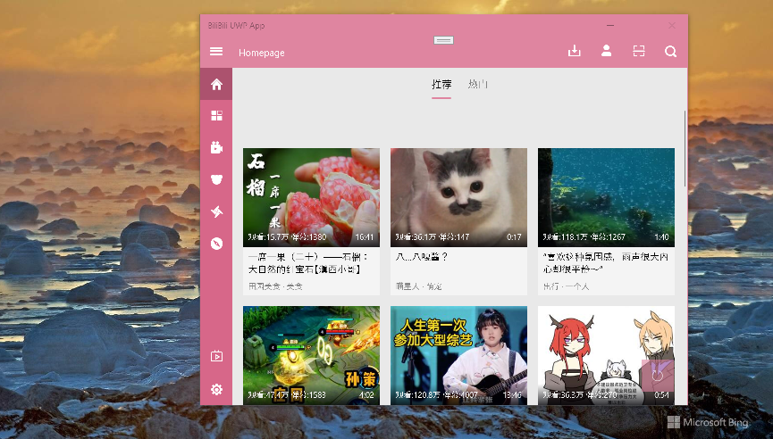

# BiliBiliUmp
This is my fork of [biliuwp](https://github.com/xiaoyaocz/biliuwp) project.

I plan to use the JSBridge "mechanizm" for TeslaX project and Capcha redirect ;)

Also I found that biliuwp has a great compatibility with win os build 15063. So, I quickly formed 
BiliBili for Win10Mobile (PoC).  My port contains some "bugs" (uncompleted code). I marked them "TODO". 

## Screenshots

## Status
- Downshifted from "Win SDK" 16299 to 15063
- Draft/RnD mode (Proof-of-concept only, not for production)
- v 3.11 : Work in progress 

## Few words from original BiliUWP's author

"
BiliBili is third-party UWP client. This is a UWP project written by a very high-level developer. 

Since the project started two or three years ago, I just learned to write UWP, so I didn't use any framework or the like. 

On this basis, I will iterate LATER. There are a bunch of BUGS and spicy chicken CODE. 

Please be prepared to be blind when reading the code.
"

## References
https://github.com/xiaoyaocz/biliuwp

## ..
AS IS. No support. DIY

## .
[m][e] 2022